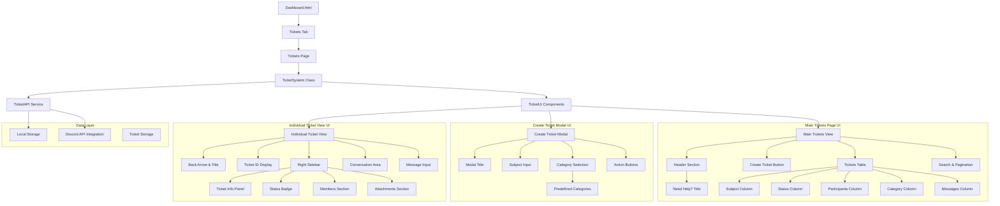
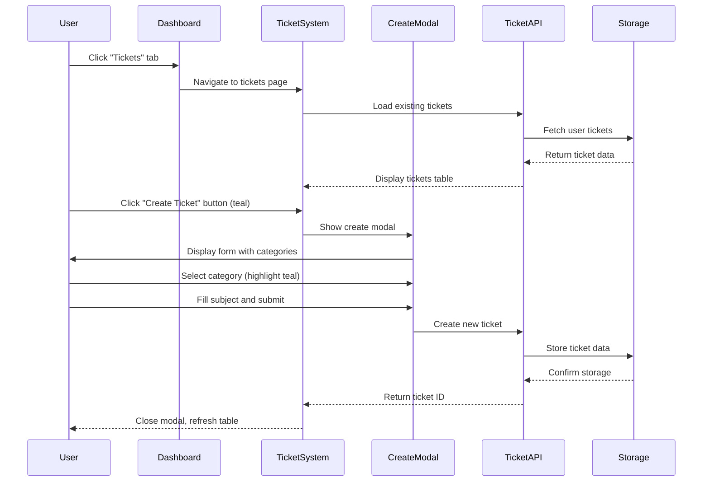
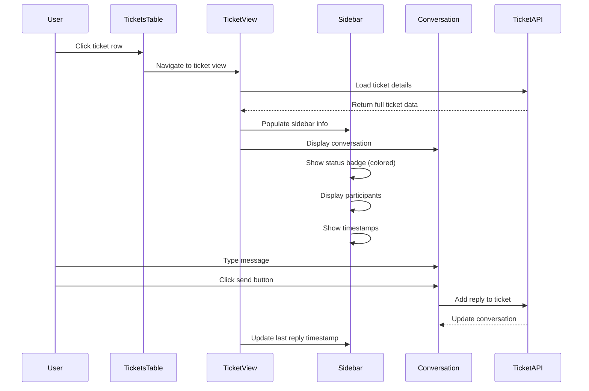

# Design Document: Ticket System

## Overview

The ticket system feature adds comprehensive support ticket functionality to the Fuse web application with a specific UI design matching the provided mockups. This includes a new "Tickets" tab in the dashboard Quick Actions section and a dedicated `/tickets` page for creating, viewing, and managing support tickets. The system features a dark blue background, teal/cyan accent colors, and follows the exact layout and styling shown in the user interface designs.

## Architecture



## Sequence Diagrams

### Ticket Creation Flow



### Individual Ticket View Flow



## UI Design Specifications

### Main Tickets Page Layout

**Background & Theme**:
- Dark blue background matching existing Fuse design system
- Consistent with dashboard.html styling patterns
- Grid background pattern maintained from existing design

**Header Section**:
- Title: "Need Help?" (large, prominent)
- Subtitle: "Search for a handbook or create a support ticket"
- Positioned in top-left area of main content

**Create Ticket Button**:
- Positioned in top-right corner
- Teal/cyan color (#00c8a8 or similar)
- Text: "Create Ticket"
- Rounded corners, medium padding
- Hover state with slight color variation

**Tickets Table**:
- Full-width table with clean borders
- Columns (left to right):
  1. Subject - Main ticket title/description
  2. Status - Colored status badge
  3. Participants - User avatars or count
  4. Category - Ticket category type
  5. Messages - Message count or last message preview
  6. Messages - (duplicate column as shown in design)
  7. Action - Three-dot menu or action button
- Alternating row colors for readability
- Hover effects on rows

**Footer Controls**:
- "Showing X to Y of Z entries" text on left
- Pagination controls on right
- Search functionality in top-right area

### Create Ticket Modal Design

**Modal Structure**:
- Overlay with dark background (rgba overlay)
- Centered modal with rounded corners
- White/light background for contrast

**Modal Header**:
- Title: "Create Support Ticket"
- Close button (X) in top-right corner

**Form Fields**:
- Subject input field:
  - Single line text input
  - Full width
  - Placeholder text
  - Border styling consistent with theme

**Category Selection**:
- Grid or list layout of category options
- Each category as clickable card/button
- Specific categories with emojis:
  - 🔧 General - General inquiries (not listed below)
  - ⚡ Ban Appeal - Appeal an account restriction
  - 💳 Stripe - Stripe billing inquiries
  - ₿ Crypto - Crypto billing inquiries
  - 🤝 Partnership - Partnership inquiries
  - 🔧 Technical Support - Report or request assistance with technical issues
- Selected category highlighted in teal/cyan color
- Hover states for unselected categories

**Modal Footer**:
- "Cancel" button (secondary styling)
- "Create Ticket" button (primary teal/cyan styling)
- Right-aligned button group

### Individual Ticket View Layout

**Header Section**:
- Back arrow button (←) in top-left
- Ticket title next to back arrow
- Ticket ID display in center area
- Breadcrumb-style navigation

**Main Layout**:
- Two-column layout
- Left: Conversation area (wider column)
- Right: Ticket info sidebar (narrower column)

**Right Sidebar - "Ticket Info"**:
- Panel title: "Ticket Info"
- Status section:
  - Colored status badge (green for open, etc.)
  - Status text
- Category display
- Timestamps:
  - "Created" with date/time
  - "Last reply" with date/time
- Members section:
  - "Members" heading
  - Participant avatars or list
  - User names and roles
- Attachments section:
  - "Attachments" heading
  - File list or "No attachments" state

**Conversation Area**:
- Message thread display
- Chronological order (newest at bottom)
- Message bubbles with:
  - User avatar
  - Username and timestamp
  - Message content
  - Distinction between user and staff messages

**Message Input**:
- Bottom of conversation area
- Text input field
- Attachment button (📎 icon)
- Send button (arrow or "Send" text)
- Teal/cyan accent color for send button

### Color Scheme & Styling

**Primary Colors**:
- Background: Dark blue (#0a0a0f or similar)
- Accent: Teal/cyan (#00c8a8, #20d0c4, or similar)
- Text: White/light gray for primary text
- Secondary text: Muted gray

**Status Colors**:
- Open: Green (#00c850)
- In Progress: Orange/yellow (#f0a500)
- Waiting: Blue (#4a90e2)
- Resolved: Purple (#8b5cf6)
- Closed: Gray (#6b7280)

**Interactive Elements**:
- Buttons: Teal/cyan primary, gray secondary
- Hover states: Slight opacity or color shift
- Focus states: Outline or border highlight
- Selected states: Teal/cyan background or border

## Components and Interfaces

### Component 1: TicketSystem

**Purpose**: Main controller class for ticket functionality, manages UI state and coordinates between API and UI components

**Interface**:
```typescript
interface ITicketSystem {
  initialize(): void
  navigateToTickets(): void
  showMainTicketsPage(): void
  showIndividualTicket(ticketId: string): void
  createTicket(ticketData: CreateTicketRequest): Promise<Ticket>
  loadTickets(): Promise<Ticket[]>
  loadTicketDetails(ticketId: string): Promise<TicketDetails>
  updateTicketStatus(ticketId: string, status: TicketStatus): Promise<void>
  addReply(ticketId: string, message: string): Promise<void>
  searchTickets(query: string): Ticket[]
  filterTickets(filters: TicketFilters): Ticket[]
}
```

**Responsibilities**:
- Initialize ticket system UI and event handlers
- Manage navigation between main tickets page and individual ticket views
- Handle ticket creation workflow with modal management
- Coordinate search and filtering functionality
- Manage UI state transitions and error handling

### Component 2: TicketUI

**Purpose**: UI component manager for rendering the specific ticket interfaces matching the design mockups

**Interface**:
```typescript
interface ITicketUI {
  renderMainTicketsPage(tickets: Ticket[]): void
  renderTicketsTable(tickets: Ticket[]): void
  renderIndividualTicketView(ticket: TicketDetails): void
  renderTicketInfoSidebar(ticket: TicketDetails): void
  renderConversationArea(ticket: TicketDetails): void
  showCreateTicketModal(): void
  hideCreateTicketModal(): void
  renderCategorySelection(): void
  highlightSelectedCategory(categoryId: string): void
  updateTicketStatusBadge(ticketId: string, status: TicketStatus): void
  showSuccessMessage(message: string): void
  showErrorMessage(error: string): void
  updatePagination(currentPage: number, totalPages: number): void
  renderSearchResults(tickets: Ticket[]): void
}
```

**Responsibilities**:
- Render main tickets page with header, table, and controls
- Manage create ticket modal with category selection
- Display individual ticket view with sidebar and conversation
- Handle status badge rendering with appropriate colors
- Manage pagination and search result display
- Provide visual feedback for user interactions

### Component 3: TicketAPI

**Purpose**: Service layer for ticket data operations and Discord API integration

**Interface**:
```typescript
interface ITicketAPI {
  getUserTickets(userId: string): Promise<Ticket[]>
  createTicket(request: CreateTicketRequest): Promise<Ticket>
  getTicketDetails(ticketId: string): Promise<TicketDetails>
  updateTicket(ticketId: string, updates: TicketUpdate): Promise<void>
  addReply(ticketId: string, reply: TicketReply): Promise<void>
  deleteTicket(ticketId: string): Promise<void>
  searchTickets(userId: string, query: string): Promise<Ticket[]>
  getTicketsByStatus(userId: string, status: TicketStatus): Promise<Ticket[]>
  getTicketsByCategory(userId: string, category: TicketCategory): Promise<Ticket[]>
}
```

**Responsibilities**:
- Handle all ticket CRUD operations
- Manage local storage persistence with user association
- Integrate with Discord user authentication
- Provide search and filtering capabilities
- Implement data validation and error handling

## Data Models

### Model 1: Ticket

```typescript
interface Ticket {
  id: string
  userId: string
  subject: string
  description?: string
  status: TicketStatus
  category: TicketCategory
  createdAt: Date
  updatedAt: Date
  lastReplyAt?: Date
  assignedTo?: string
  participants: string[]
  messageCount: number
  tags: string[]
}
```

**Validation Rules**:
- `id` must be unique UUID format
- `subject` must be 5-100 characters, non-empty
- `description` optional for initial creation, can be added later
- `status` must be valid TicketStatus enum value
- `userId` must match authenticated Discord user ID
- `participants` array includes userId and any staff members

### Model 2: TicketDetails

```typescript
interface TicketDetails extends Ticket {
  replies: TicketReply[]
  attachments: TicketAttachment[]
  history: TicketHistoryEntry[]
  members: TicketMember[]
}
```

**Validation Rules**:
- Extends all Ticket validation rules
- `replies` array can be empty but not null
- Each reply must have valid timestamp and author
- `members` includes full user information for participants

### Model 3: CreateTicketRequest

```typescript
interface CreateTicketRequest {
  subject: string
  category: TicketCategory
  description?: string
  attachments?: File[]
}
```

**Validation Rules**:
- `subject` required, 5-100 characters
- `category` must be one of the predefined categories
- `description` optional during creation
- `attachments` limited to 5 files, max 10MB each
- Supported file types: images, text files, logs

### Model 4: TicketReply

```typescript
interface TicketReply {
  id: string
  ticketId: string
  authorId: string
  authorName: string
  authorAvatar?: string
  message: string
  createdAt: Date
  isStaff: boolean
  attachments?: TicketAttachment[]
}
```

**Validation Rules**:
- `message` must be 1-1000 characters
- `authorId` must match Discord user ID format
- `isStaff` determined by Discord role validation
- `authorAvatar` URL for Discord avatar display

### Model 5: TicketMember

```typescript
interface TicketMember {
  userId: string
  username: string
  displayName: string
  avatar?: string
  isStaff: boolean
  joinedAt: Date
}
```

**Validation Rules**:
- `userId` must be valid Discord user ID
- `username` and `displayName` from Discord API
- `avatar` URL for profile picture display
- `isStaff` based on Discord role permissions

### Model 6: Enums

```typescript
enum TicketStatus {
  OPEN = 'open',
  IN_PROGRESS = 'in_progress',
  WAITING_FOR_RESPONSE = 'waiting_for_response',
  RESOLVED = 'resolved',
  CLOSED = 'closed'
}

enum TicketCategory {
  GENERAL = 'general',
  BAN_APPEAL = 'ban_appeal',
  STRIPE = 'stripe',
  CRYPTO = 'crypto',
  PARTNERSHIP = 'partnership',
  TECHNICAL_SUPPORT = 'technical_support'
}

// Category display information matching UI design
const CATEGORY_INFO = {
  [TicketCategory.GENERAL]: {
    emoji: '🔧',
    title: 'General',
    description: 'General inquiries (not listed below)'
  },
  [TicketCategory.BAN_APPEAL]: {
    emoji: '⚡',
    title: 'Ban Appeal',
    description: 'Appeal an account restriction'
  },
  [TicketCategory.STRIPE]: {
    emoji: '💳',
    title: 'Stripe',
    description: 'Stripe billing inquiries'
  },
  [TicketCategory.CRYPTO]: {
    emoji: '₿',
    title: 'Crypto',
    description: 'Crypto billing inquiries'
  },
  [TicketCategory.PARTNERSHIP]: {
    emoji: '🤝',
    title: 'Partnership',
    description: 'Partnership inquiries'
  },
  [TicketCategory.TECHNICAL_SUPPORT]: {
    emoji: '🔧',
    title: 'Technical Support',
    description: 'Report or request assistance with technical issues'
  }
}
```

## Error Handling

### Error Scenario 1: Authentication Failure

**Condition**: User not authenticated or token expired when accessing tickets
**Response**: Redirect to Discord OAuth flow, show authentication required message
**Recovery**: After successful authentication, return to tickets page with original intent preserved

### Error Scenario 2: Ticket Creation Failure

**Condition**: Network error, validation failure, or storage quota exceeded during ticket creation
**Response**: Display specific error message in modal, preserve form data, highlight invalid fields
**Recovery**: Allow user to correct issues and retry submission, implement auto-save for form data

### Error Scenario 3: Data Loading Failure

**Condition**: Unable to load tickets due to network issues or corrupted local storage
**Response**: Show loading error state in tickets table, fallback to cached data if available
**Recovery**: Provide manual refresh button, clear corrupted cache option, show offline indicator

### Error Scenario 4: Individual Ticket View Error

**Condition**: Unable to load specific ticket details or ticket not found
**Response**: Show error message in ticket view, provide back navigation to main tickets page
**Recovery**: Redirect to tickets list, highlight issue in error message, suggest refresh

### Error Scenario 5: Category Selection Error

**Condition**: Invalid category selection or category data corruption
**Response**: Highlight invalid selection in modal, show validation message
**Recovery**: Reset to default category selection, allow user to choose valid category

## CSS Styling Implementation

### Main Tickets Page Styles

```css
.tickets-page {
  background: #0a0a0f;
  min-height: 100vh;
  color: #fff;
  font-family: 'DM Sans', sans-serif;
}

.tickets-header {
  display: flex;
  justify-content: space-between;
  align-items: flex-start;
  margin-bottom: 2rem;
}

.tickets-title {
  font-family: 'Montserrat', sans-serif;
  font-size: 2rem;
  font-weight: 800;
  margin-bottom: 0.5rem;
}

.tickets-subtitle {
  color: rgba(255, 255, 255, 0.6);
  font-size: 1rem;
}

.create-ticket-btn {
  background: #00c8a8;
  color: white;
  border: none;
  padding: 12px 24px;
  border-radius: 8px;
  font-weight: 600;
  cursor: pointer;
  transition: background 0.2s;
}

.create-ticket-btn:hover {
  background: #00b396;
}

.tickets-table {
  width: 100%;
  background: rgba(255, 255, 255, 0.04);
  border: 1px solid rgba(255, 255, 255, 0.08);
  border-radius: 12px;
  overflow: hidden;
}

.tickets-table th {
  background: rgba(255, 255, 255, 0.06);
  padding: 16px;
  text-align: left;
  font-weight: 600;
  border-bottom: 1px solid rgba(255, 255, 255, 0.08);
}

.tickets-table td {
  padding: 16px;
  border-bottom: 1px solid rgba(255, 255, 255, 0.04);
}

.tickets-table tr:hover {
  background: rgba(255, 255, 255, 0.02);
  cursor: pointer;
}

.status-badge {
  padding: 4px 12px;
  border-radius: 16px;
  font-size: 0.75rem;
  font-weight: 600;
  text-transform: uppercase;
}

.status-open { background: rgba(0, 200, 80, 0.2); color: #00c850; }
.status-in-progress { background: rgba(240, 165, 0, 0.2); color: #f0a500; }
.status-waiting { background: rgba(74, 144, 226, 0.2); color: #4a90e2; }
.status-resolved { background: rgba(139, 92, 246, 0.2); color: #8b5cf6; }
.status-closed { background: rgba(107, 114, 128, 0.2); color: #6b7280; }
```

### Create Ticket Modal Styles

```css
.modal-overlay {
  position: fixed;
  top: 0;
  left: 0;
  right: 0;
  bottom: 0;
  background: rgba(0, 0, 0, 0.8);
  display: flex;
  align-items: center;
  justify-content: center;
  z-index: 1000;
}

.create-ticket-modal {
  background: #1a1a1f;
  border-radius: 16px;
  padding: 24px;
  width: 90%;
  max-width: 600px;
  max-height: 80vh;
  overflow-y: auto;
}

.modal-header {
  display: flex;
  justify-content: space-between;
  align-items: center;
  margin-bottom: 24px;
}

.modal-title {
  font-family: 'Montserrat', sans-serif;
  font-size: 1.5rem;
  font-weight: 700;
}

.close-btn {
  background: none;
  border: none;
  color: rgba(255, 255, 255, 0.6);
  font-size: 1.5rem;
  cursor: pointer;
}

.form-group {
  margin-bottom: 20px;
}

.form-label {
  display: block;
  margin-bottom: 8px;
  font-weight: 600;
}

.form-input {
  width: 100%;
  padding: 12px;
  background: rgba(255, 255, 255, 0.06);
  border: 1px solid rgba(255, 255, 255, 0.12);
  border-radius: 8px;
  color: white;
  font-size: 1rem;
}

.category-grid {
  display: grid;
  grid-template-columns: repeat(auto-fit, minmax(250px, 1fr));
  gap: 12px;
  margin-top: 12px;
}

.category-option {
  padding: 16px;
  background: rgba(255, 255, 255, 0.04);
  border: 2px solid rgba(255, 255, 255, 0.08);
  border-radius: 12px;
  cursor: pointer;
  transition: all 0.2s;
}

.category-option:hover {
  background: rgba(255, 255, 255, 0.08);
}

.category-option.selected {
  background: rgba(0, 200, 168, 0.1);
  border-color: #00c8a8;
}

.category-emoji {
  font-size: 1.5rem;
  margin-bottom: 8px;
}

.category-title {
  font-weight: 600;
  margin-bottom: 4px;
}

.category-description {
  font-size: 0.875rem;
  color: rgba(255, 255, 255, 0.6);
}

.modal-footer {
  display: flex;
  justify-content: flex-end;
  gap: 12px;
  margin-top: 24px;
}

.btn-secondary {
  padding: 10px 20px;
  background: rgba(255, 255, 255, 0.08);
  border: 1px solid rgba(255, 255, 255, 0.12);
  border-radius: 8px;
  color: white;
  cursor: pointer;
}

.btn-primary {
  padding: 10px 20px;
  background: #00c8a8;
  border: none;
  border-radius: 8px;
  color: white;
  font-weight: 600;
  cursor: pointer;
}
```

### Individual Ticket View Styles

```css
.ticket-view {
  display: grid;
  grid-template-columns: 1fr 300px;
  gap: 24px;
  height: calc(100vh - 120px);
}

.ticket-header {
  display: flex;
  align-items: center;
  gap: 16px;
  margin-bottom: 24px;
}

.back-btn {
  background: none;
  border: none;
  color: #00c8a8;
  font-size: 1.2rem;
  cursor: pointer;
}

.ticket-title {
  font-family: 'Montserrat', sans-serif;
  font-size: 1.5rem;
  font-weight: 700;
}

.ticket-id {
  color: rgba(255, 255, 255, 0.6);
  font-size: 0.875rem;
}

.conversation-area {
  background: rgba(255, 255, 255, 0.04);
  border: 1px solid rgba(255, 255, 255, 0.08);
  border-radius: 12px;
  display: flex;
  flex-direction: column;
  height: 100%;
}

.messages-container {
  flex: 1;
  padding: 20px;
  overflow-y: auto;
}

.message {
  display: flex;
  gap: 12px;
  margin-bottom: 16px;
}

.message-avatar {
  width: 40px;
  height: 40px;
  border-radius: 50%;
  flex-shrink: 0;
}

.message-content {
  flex: 1;
}

.message-header {
  display: flex;
  align-items: center;
  gap: 8px;
  margin-bottom: 4px;
}

.message-author {
  font-weight: 600;
}

.message-timestamp {
  font-size: 0.75rem;
  color: rgba(255, 255, 255, 0.5);
}

.staff-badge {
  background: #00c8a8;
  color: white;
  padding: 2px 6px;
  border-radius: 4px;
  font-size: 0.625rem;
  font-weight: 600;
}

.message-input-area {
  padding: 20px;
  border-top: 1px solid rgba(255, 255, 255, 0.08);
  display: flex;
  gap: 12px;
}

.message-input {
  flex: 1;
  padding: 12px;
  background: rgba(255, 255, 255, 0.06);
  border: 1px solid rgba(255, 255, 255, 0.12);
  border-radius: 8px;
  color: white;
  resize: none;
}

.send-btn {
  background: #00c8a8;
  border: none;
  border-radius: 8px;
  color: white;
  padding: 12px 16px;
  cursor: pointer;
}

.ticket-sidebar {
  background: rgba(255, 255, 255, 0.04);
  border: 1px solid rgba(255, 255, 255, 0.08);
  border-radius: 12px;
  padding: 20px;
  height: fit-content;
}

.sidebar-section {
  margin-bottom: 24px;
}

.sidebar-title {
  font-weight: 600;
  margin-bottom: 12px;
  color: rgba(255, 255, 255, 0.8);
}

.info-item {
  display: flex;
  justify-content: space-between;
  margin-bottom: 8px;
}

.info-label {
  color: rgba(255, 255, 255, 0.6);
  font-size: 0.875rem;
}

.info-value {
  font-weight: 500;
}

.members-list {
  display: flex;
  flex-direction: column;
  gap: 8px;
}

.member-item {
  display: flex;
  align-items: center;
  gap: 8px;
}

.member-avatar {
  width: 24px;
  height: 24px;
  border-radius: 50%;
}

.member-name {
  font-size: 0.875rem;
}
```

## Testing Strategy

### Unit Testing Approach

Focus on testing individual components in isolation with comprehensive coverage of business logic, data validation, and error handling. Key test areas include:

- TicketAPI service methods with mocked storage and network calls
- Data model validation functions with edge cases and boundary conditions
- UI component rendering with various ticket states and user permissions
- Error handling scenarios with simulated failures and recovery paths

**Coverage Goals**: 90% code coverage with emphasis on critical paths and error scenarios

### Property-Based Testing Approach

Use property-based testing to validate data integrity and system behavior across wide input ranges.

**Property Test Library**: fast-check (JavaScript/TypeScript property-based testing)

**Key Properties to Test**:
- Ticket ID generation produces unique, valid UUIDs
- Ticket status transitions follow valid state machine rules
- User permission checks are consistent across all operations
- Data serialization/deserialization maintains integrity
- Search and filtering operations return consistent results

### Integration Testing Approach

Test component interactions and data flow between UI, API, and storage layers:

- End-to-end ticket creation and management workflows
- Discord authentication integration with ticket access controls
- Local storage persistence and data migration scenarios
- Cross-browser compatibility and responsive design validation

## Performance Considerations

**Lazy Loading**: Implement pagination for ticket lists to handle large numbers of tickets efficiently. Load ticket details on-demand when user clicks on specific tickets.

**Caching Strategy**: Cache frequently accessed tickets in memory with TTL expiration. Use local storage for offline access to recently viewed tickets.

**Search Optimization**: Implement client-side search with debounced input for responsive filtering. Consider indexing for large ticket datasets.

**Bundle Size**: Keep ticket system as separate module to avoid impacting main application load time. Use dynamic imports for ticket page functionality.

## Security Considerations

**Authentication**: Leverage existing Discord OAuth integration for user authentication. Validate user tokens on each API request.

**Authorization**: Implement role-based access controls using Discord roles. Users can only access their own tickets unless they have staff permissions.

**Data Validation**: Sanitize all user inputs to prevent XSS attacks. Validate file uploads for type, size, and content safety.

**Privacy**: Store minimal user data locally. Implement data retention policies for closed tickets. Provide user data export/deletion capabilities.

**Rate Limiting**: Implement client-side rate limiting for ticket creation to prevent spam. Add cooldown periods for rapid successive submissions.

## Dependencies

**External Dependencies**:
- Font Awesome 6.5.1 (already included) - for ticket icons and UI elements
- Discord API v10 (already integrated) - for user authentication and role validation
- Browser APIs: localStorage, File API, Fetch API

**Internal Dependencies**:
- Existing authentication system from dashboard.html
- Current CSS styling system and design tokens
- Utility functions from src/utils.ts
- Type definitions from src/types.ts

**New Dependencies**:
- UUID generation library (or crypto.randomUUID() if available)
- Date formatting library (or native Intl.DateTimeFormat)
- File upload handling utilities
- Search/filtering utilities for ticket management